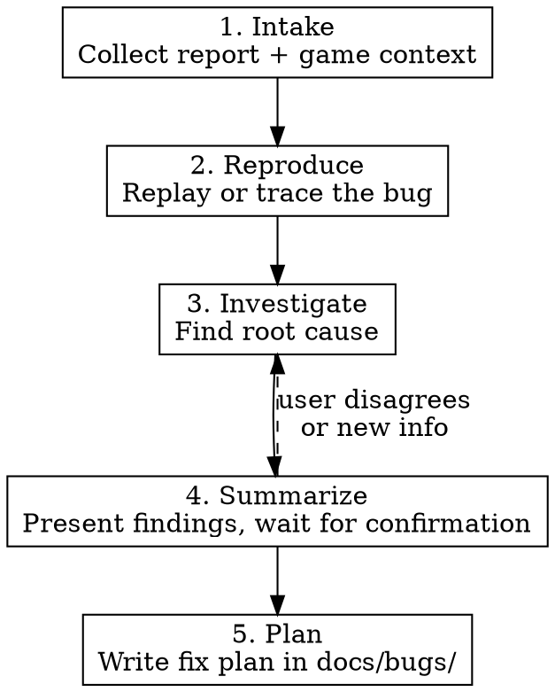

# Bug Investigation

Structured process for triaging game bugs: collect context, find root cause, confirm with reporter, write a fix plan.

## Workflow



## Phase 1: Intake

Collect these from the reporter. Ask for anything missing:

| Field | Why |
|-------|-----|
| **Game mode** | LevelMode or TideMode -- different wave params, budgets, and phase flow |
| **Phase** | Planning or Wave -- narrows which systems are involved |
| **Level / wave number** | Affects difficulty params (peakHeight, scoopBudget, elevation bounds) |
| **Expected vs actual** | What should have happened vs what did |
| **Debug JSON** | Press D to copy board state. Contains elevations, columnHeights, puddleDepths, castle position |
| **Steps to reproduce** | Sequence of actions leading to the bug |

If the reporter has debug JSON, get it first -- it's the fastest path to reproduction.

## Phase 2: Reproduce

**With debug JSON:** Reconstruct the board from the JSON (cells, elevations, columnHeights, castle position) and trace it through the wave runtime. (The old `tools/replay-wave.ts` replay script was retired in the terrain→Actor migration, since terrain now requires a browser context and can't run in pure Node; rebuild it as a browser-Vitest harness if a replay tool is needed again.)

**Without debug JSON:** Trace through code using the reported game mode, level, and phase to reconstruct state. Check:
- `LevelMode.nextWaveParams()` / `TideMode.nextWaveParams()` for wave parameters at that level
- `scoopBudget()` for planning constraints
- `elevationBounds()` for elevation caps

**Planning phase bugs:** Check `PlanningPhase`, the active digging strategy (`DragDigging` or `SingleCellDigging`), and `Toolbar` input handling.

**Wave phase bugs:** Check `simulateWave()`, `WaveRenderer.playWave()`, erosion/puddle application in `GameSession.runWavePhase()`.

## Phase 3: Investigate

Work backward from the symptom to the root cause:

1. **Read error messages / visual symptoms carefully.** Don't skip past them.
2. **Identify the component boundary where behavior diverges from expectation.**
   - Model layer (`grid-model`, `wave-simulation`, `flow-field`) -- wrong state or calculation?
   - View layer (`grid-view`, `tile`, `wave-renderer`, `planning-phase`) -- wrong rendering or input handling?
   - Mode layer (`level-mode`, `tide-mode`) -- wrong params or phase transitions?
   - Session layer (`game-session`) -- wrong orchestration?
3. **Trace data flow** through the suspect component. Check inputs and outputs at each boundary.
4. **Check recent changes** with `git log` and `git diff` for the affected files.
5. **Find working examples** -- does similar behavior work correctly elsewhere? What differs?

### Common bug categories

| Category | Where to look |
|----------|--------------|
| Wave doesn't interact with terrain correctly | `wave-simulation.ts` -- elevation/puddle handling |
| Tile renders wrong color or elevation | `tile.ts` -- color calculation, `grid-view.ts` -- update cycle |
| Scoop/wall tool doesn't work | `planning-phase.ts`, `drag-digging.ts`, `single-cell-digging.ts`, `toolbar.ts` |
| Wave reaches castle unexpectedly | `wave-simulation.ts` -- castleFlooded check, terrain slope calc |
| Level progression wrong | `level-mode.ts` or `tide-mode.ts` -- param formulas, `game-session.ts` -- advanceLevel |
| HUD shows wrong info | `hud.ts` -- data binding |
| Game over / restart broken | `game-session.ts` -- resetGame, resolveWave |

## Phase 4: Summarize

Present findings to the user before writing the plan. Include:

- **Reproduction:** How to trigger the bug (steps or replay command)
- **Root cause:** Which component and why it fails
- **Game mode / phase:** Where it occurs and whether it affects both modes
- **Affected files:** List of files involved

Wait for the user to confirm or provide corrections before proceeding.

## Phase 5: Plan

Write a fix plan in `docs/bugs/YYYY-MM-DD-<slug>.md` following the project's plan format:

```markdown
# <Bug title>

## Problem

<Description of the bug, including game mode and phase>

## Root cause

<What's wrong and why>

## Reproduction

<Steps or replay command>

## Solution

<Proposed fix>

## Files to change

<List of affected files with brief description of changes>

## Tasks

- [ ] <task 1>
- [ ] <task 2>
- [ ] Run typecheck, lint, unit tests
```
