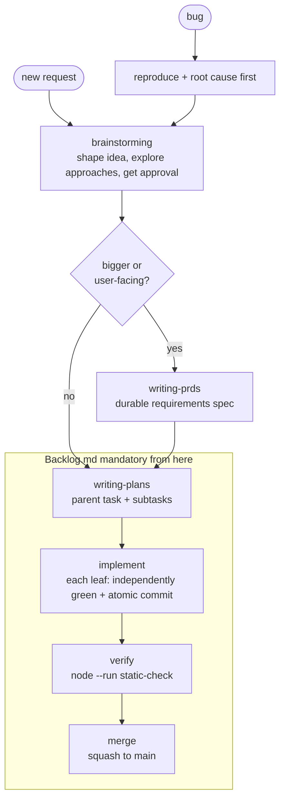

# Agent Workflow

This file is the repo-local tuning surface for agent workflow. Core skills stay tool-agnostic and consult this file for the current project style.

## Flow

- Before the Backlog boundary (discovery), conversation plus `todowrite` is enough; no task needed yet.
- Core skills must not hardcode Backlog.md behavior — they read this file and adapt.

## Collaboration Style

- Collaborate before implementation when the request changes behavior, architecture, gameplay, workflow, or project conventions.
- Keep the collaboration lightweight. Small, obvious edits can use a short design summary and proceed after approval.
- Ask one focused question at a time when requirements are unclear.
- Do not create ceremony just because a generic skill says to. Prefer the smallest process that keeps the work correct and reviewable.

## Product Requirements (PRDs)

- The PRD is the durable requirements spec for bigger or user-facing work; the plan is written against it. Skip it for small, well-understood work — a lightweight design in the Backlog task is enough.
- During brainstorming, recommend a PRD when the work is user-facing, changes gameplay, or spans multiple systems. The user confirms whether to write one.
- PRDs are stored as Backlog docs tagged `prd`. The `writing-prds` skill stays tool-agnostic; this is the repo mechanism it defers to:
  - Create: `backlog doc create "<Feature> PRD" -t specification`
  - Set body and tag: `backlog doc update <docId> --content "<markdown>" --tags prd`
  - Find: `backlog doc list --plain` or `backlog search "<feature>" --plain`
- The Backlog parent task must reference the PRD via `--doc <path>` (the docs-relative path returned by `doc create`) so plan and requirements stay linked.
- Never edit Backlog doc files directly; use the CLI.

## Planning

- The plan lives in the Backlog parent task's `Implementation Plan` field: intended execution order, major work slices, key file areas, and the parent/subtask relationship.
- Each implementation unit becomes a subtask unless the work is small enough to stay a single task.
- Every leaf task (any subtask, or any task without subtasks) must include an Acceptance Criterion requiring an atomic git commit for its scoped change.
- Plans name exact files likely to change, key risks, tests to run, and docs to update, and define dependency relationships so execution order is unambiguous.
- Decompose so each leaf task ends independently green: its scoped tests pass, lint/typecheck are clean, no unused variables, and it does not depend on a later task to restore the repo to a good state.
- Keep plans proportional to risk:
  - Small single-file changes: short plan in the Backlog task after approval.
  - Multi-file or gameplay changes: parent task plus subtasks with concrete file and verification details.
  - Architectural or workflow changes: include alternatives, tradeoffs, and explicit acceptance criteria.

## Task Tracking

- Backlog.md is the durable task system for substantive work. Read `docs/backlog-instructions.md` for the CLI guide.
- Use the Backlog CLI for task creation, updates, acceptance criteria, notes, comments, final summary, labels, and status changes. Never edit Backlog task files directly.
- Record task dependencies so it is clear which tasks block others and which can run in parallel.
- Implementation work happens on `feat/<slug>` branches. Verify you are on the correct branch before starting, and create or switch if needed.
- Do not duplicate a separate `docs/plans/` artifact when the Backlog parent task already contains the plan. Standalone `docs/plans/` or `docs/bugs/` docs are exceptions, created only when explicitly requested.

## Bugs

- Use a bug label in Backlog for bug work.
- Start with reproduction and root cause, not fixes.
- Debug JSON from the game is high-value evidence. Press `D` in-game to copy board state as JSON.
- Only create a standalone `docs/bugs/` writeup if explicitly requested.

## Verification

- Before claiming implementation work is complete, run `node --run static-check` unless the change is documentation-only or the user asks not to.
- For unused-export failures from Knip during in-progress task work, see [knip-unused-policy.md](./knip-unused-policy.md).
- Parent tasks verify that every leaf task includes an Acceptance Criterion for an atomic git commit.
- A leaf task is not complete unless its scoped change is independently green before any dependent follow-on task starts.
- For documentation-only or skill-only changes, inspect the changed files for obvious broken references.
- If verification cannot be run, state what blocked it and what was verified instead.

## Project-Specific Defaults

- The dev server is normally already running. Do not start another one.
- Gameplay changes must update `docs/gameplay.md` in the same change.
- Use Context7 docs for Excalibur.js questions before relying on memory.
- This repo is not set up for git worktrees. Do not create worktrees.
