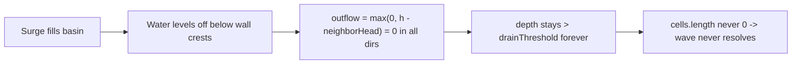

# Trapped water never drains (wall-enclosed basins)

- **Date:** 2026-06-14
- **Area:** pressure-driven wave runtime (`PRESSURE_WATER_ENABLED = true`)
- **Severity:** high — the wave phase can hang indefinitely
- **Status:** fixed (2026-06-15)

## Symptom

When walls are built so they enclose a basin (a ring/pocket of walls around lower
ground), water that flows in during the surge gets stuck and never clears out. It
sits at a fixed level forever instead of receding.

> Reported with a screenshot of a wall-enclosed pocket. (Screenshot not attached
> to this writeup; reproduce per the steps below.)

Because the wave only resolves when all water is gone, the trapped puddle also
means the wave phase never ends.

## Repro

1. In planning, build walls that fully enclose one or more interior cells (so the
   enclosed cells are lower than every surrounding wall crest), over flat ground
   (not holes).
2. Run the wave. Water overtops/enters the basin during the surge.
3. After the source closes and the open water recedes to the ocean, the water
   inside the basin remains, holding a constant depth.

## Root cause

The flux solver only moves water *downhill* to a lower-head neighbor, plus the
ocean sink north of row 0. There is no evaporation, seepage, or absorption term
for ordinary (non-hole) land.

In `computeFluxStep` (`src/wave/wave-dynamic-system.ts:128`), outflow from a cell is:

```
out = max(0, h - neighborHead) * coeff
```

where `h = groundAt(col,row) + depth`. Once water in a wall-enclosed basin levels
off below the surrounding wall crests, every in-bounds neighbor has
`neighborHead >= h`, so `out = 0` in all four directions. The only sinks are:

- a lower-head neighbor (blocked — walls are higher), or
- the ocean sink, reachable only from row 0 (basin is interior).

Holes drain via `applyTerrainFeedback` into `puddleDepth`, but that path is
hole-only and capped at finite capacity; a wall basin over flat ground has no
sink at all.

So the basin depth stays above `PRESSURE_DRAIN_THRESHOLD` (`0.01`,
`src/config.ts:157`) indefinitely. The wet-cell set never empties, and the wave
resolves only when `!sourceOpen && cells.length === 0`
(`src/wave/wave-dynamic-system.ts:271`) — which never becomes true.



## Fix

Environmental seepage added in `WaveDynamicSystem.postupdate`
(`src/wave/wave-dynamic-system.ts`). Once the source closes (`!sourceOpen`),
every live `WaterComponent`'s depth is decremented by
`PRESSURE_SEEP_RATE_PER_MS * elapsed` each render frame (0.0012 depth/ms,
`src/config.ts`). This represents the sand absorbing standing water.

**Why holes are unaffected.** `applyTerrainFeedback` runs inside `update()` and
pulls a filling hole's surface water into `puddleDepth` before `postupdate`
executes. So by the time the universal decrement runs, a hole that still has
capacity has no live surface `WaterComponent` — the decrement only touches
water over flat ground, full holes, and wall-enclosed basins.

**Why this terminates the wave.** The seepage drives the basin depth below
`PRESSURE_DRAIN_THRESHOLD` (0.01). On the next `update()` tick, `computeFluxStep`
omits any cell at or below that threshold, so the cell is dropped from the wet
set. Once the last cell drains, `cells.length === 0` becomes true and
`onComplete` fires normally.
