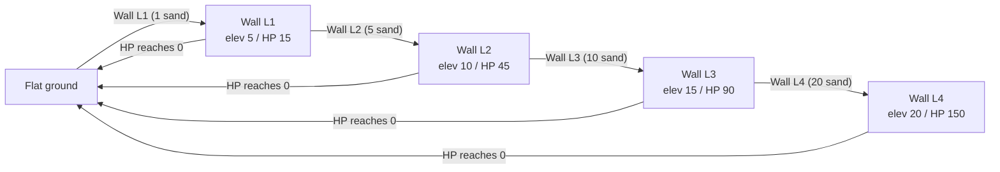

# Castle - gameplay design

## Concept

A tile-based wave defense game. The player reshapes sand before water advances from the top of the screen toward a castle. The goal is to survive as long as possible.

Terrain and sand inventory persist during a run. In Classic, digs and builds carry over from level to level. In Tide, they carry over from wave to wave. A game over or confirmed `Exit` resets the run.

## Grid

- **Size**: 16 tiles wide × 16 tiles tall (configurable)
- **Tile type**: All sand (homogeneous for MVP)
- **Elevation**: Integer per tile, starting at 0
  - Positive = raised (wall/berm)
  - Negative = dug (hole/moat)
  - Default cap: max +20 / min -20
  - In Classic, levels 10-19 clamp terrain to +15 / -15 before returning to +20 / -20 at level 20+

## Castle

- 2x2 castle fixed at column 7, row 11
- Cannot be moved, dug, raised, or eroded
- If water reaches any castle tile, the run ends

## Turn Structure

Classic has two phases per level. Tide uses the same planning and wave loop, but waves arrive on a countdown.

### 1. Planning phase
Planning starts with no selection and the toolbar fully disabled. The player selects a cell and applies tools to it. Click any non-castle cell to select it; a highlight marks the selection. Arrow keys move the selection one cell at a time, skipping the castle. The toolbar enables only the actions valid for the selected cell. Clicking a tool or pressing its hotkey triggers the action, and actions repeat in place on the selected cell. Six tools are available:

- **Shovel** (hotkey: 1): Dig the selected cell, lowering elevation by 1 and adding 1 sand to inventory. Only valid on flat ground and holes, not on walls.
- **Wall L1** (hotkey: 2): Place a level-1 wall on flat ground for 1 sand. Blocking elevation: 5.
- **Wall L2** (hotkey: 3): Upgrade a level-1 wall to level 2 for 5 sand. Blocking elevation: 10.
- **Wall L3** (hotkey: 4): Upgrade a level-2 wall to level 3 for 10 sand. Blocking elevation: 15.
- **Wall L4** (hotkey: 5): Upgrade a level-3 wall to level 4 for 20 sand. Blocking elevation: 20.
- **Tower** (hotkey: 6): Place a height-15 tower on selected flat ground for 15 sand. Disabled on non-flat cells or when sand is below 15.

Wall levels must be built in sequence on one cell (L1 on flat ground, then L2 on L1, and so on). The toolbar lights up only the next valid wall level for the selected cell. A wall cell cannot be shoveled; shovel is only valid on flat ground and holes.



Only shovel actions decrement the finite Classic planning budget. Walls and towers spend sand inventory but do not reduce the shovel budget. Classic planning ends when the shovel budget reaches 0. Tide planning has no shovel limit; the next wave starts when the countdown expires.

Sand inventory persists across waves and levels during the current run. It resets to 0 on game over or confirmed `Exit`.

**Action budget per level (classic mode):**
- Level 1: 5 actions
- Each subsequent level: +1 action
- Configurable via `SCOOP_START` and `SCOOP_INCREMENT` constants

**Toolbar UI:** Always visible near the bottom-center of the screen. Shows tool slots with sprites, hotkey indicators, and sand costs. Tools are enabled or disabled based on the selected cell and available sand. The toolbar is disabled outside planning.

**Gameplay controls:** Classic and Tide show a small menu in the top-left corner. The speaker button mutes or unmutes future sound effects and persists the setting across reloads. The `Exit` button opens a confirmation dialog. Confirming returns to the title screen and abandons the current run. In Tide, the confirmation dialog pauses the countdown and locks planning until the player cancels or exits. Hold `L` to show elevation labels. Press `D` to copy debug board serialization. In Tide, press `W` to start the next wave immediately instead of waiting for the countdown (ignored while a wave is already running).

### 2. Wave phase
The wave advances automatically when the planning phase ends:
- The wave starts above the grid and advances downward as one Excalibur `WaveSegment` actor per column
- Each segment uses velocity-driven movement, starts faster, then eases slower near its inland turnaround and ocean exit, and enters tiles as it crosses row boundaries
- Each column starts with generated depth and a staggered noisy spawn offset, creating an uneven wave front
- Moving and settled water both use depth-based sprite alpha, so shallow water appears more transparent than deeper water
- The moist sand overlay clears permanently where waves cover tiles, and the moist region renders through a blurred, thresholded coverage mask so its boundary is a smooth rounded edge instead of blocky tile steps
- When a surging segment first covers grid row `0`, a matching visual water tile also appears in the ocean row above the grid
- Flat ground reduces segment depth by `TERRAIN_SLOPE` when entered
- Holes absorb segment depth, walls and towers block or reduce it, and castle entry ends the run
- Actor waves currently do not spread blocked water sideways.
- Water left standing where it cannot flow out (such as a wall-enclosed basin) soaks into the sand during the recede and clears before the wave ends.

**Wave segment/tile interaction per column, per row entered:**

| Tile state | Effect |
|---|---|
| Flat ground | Segment depth drops by `TERRAIN_SLOPE` |
| Wall or tower height W where W >= segment depth | Segment is blocked and recedes |
| Wall or tower height W where W < segment depth | Segment depth is reduced by W and continues |
| Hole with remaining capacity D where D >= segment depth | Segment is absorbed and recedes |
| Hole with remaining capacity D where D < segment depth | Hole absorbs D, then remaining segment depth continues |
| Castle | Run ends |

The wave phase plays out as moving actors. Terrain changes apply as segment events fire, so repeated segment hits during a wave can erode or fill terrain immediately.

#### Wave shape

Waves use a multi-peak curve across columns:

```
columnHeight[col] = peakHeight * valleyFraction + (peakHeight - peakHeight * valleyFraction) * abs(sin(pi * x))
```

`x` is based on the column, a small random phase offset, and a randomly selected number of peaks. The current peak-count weights are `[1, 3, 2]`, meaning 1, 2, or 3 peaks are possible and 2 peaks are most common. Valleys are `WAVE_VALLEY_FRACTION` of peak height.

Classic peak height increases by level and later waves within a level. Tide peak height increases with waves survived.

#### Wave reach

There is no hard wave-reach cutoff. The actor wave runtime can traverse the full grid. Effective reach comes from segment depth, `TERRAIN_SLOPE`, holes, walls, towers, puddles, and immediate terrain changes during segment events. The Classic planning HUD shows the approximate flat-ground reach for the strongest wave in the upcoming level.

### Erosion

During the actor-wave runtime, non-castle terrain erodes when a wave segment enters that tile.

**Walls** use a cumulative HP model with all-or-nothing destruction:

- A wall takes 1 HP of damage per qualifying hit: a wave that overtops the wall by 2 or more (wave depth minus wall elevation >= 2) counts.
- A wall holds its full blocking elevation until HP reaches 0, then the entire wall vanishes to flat ground in one step. There is no gradual step-down and no sand refund.
- Wall HP never auto-heals between waves or between levels. Damage is permanent for the life of that wall.
- The only way to restore durability is to upgrade the wall (placing the next level creates a fresh wall at that level's full HP).
- Shovel does not affect walls. Walls are removed only by water destruction or by upgrading to the next level.

| Wall level | Blocking elevation | Max HP |
|---|---|---|
| L1 | 5 | 15 |
| L2 | 10 | 45 |
| L3 | 15 | 90 |
| L4 | 20 | 150 |

**Holes** lose 1 elevation step after 3 hits. A hole at elevation -2 hit 3 times becomes -1. A hole that reaches 0 becomes flat ground. When a wave blocks or overtops a hole, sand redistributes: the hole is raised by 1, and if the tile immediately above is also a hole, that hole is filled by 1 as well.

**Towers** erode slower. A tower loses 1 height after 10 hits. Towers ignore direct dig/build deltas after placement.

## Progression

- Surviving all waves in a Classic level advances to the next level
- Terrain and sand inventory persist during the run
- On level advance in Classic, tower and hole hit counts reset, but terrain elevation persists and wall HP persists (wall damage carries across levels)
- Classic wave peak height increases every 2 levels
- Classic wave count increases every 2 levels
- Tide wave peak height scales with waves survived
- Wave columns use a randomized multi-peak curve
- Scoop budget increases each level (+1, configurable)
- Erosion gradually degrades terrain hit by waves
- No win condition. Classic tracks level reached. Tide tracks waves survived.

## Loss Condition

Water reaches any castle tile during the wave phase.

## Reset on Game Over or Exit

When the player restarts after a game over or confirms `Exit` and starts a mode again:
- Grid is reconstructed, so all terrain returns to flat elevation 0
- All tile hit counts (erosion counters) reset to 0
- Sand inventory resets to 0
- Classic level resets to 1
- Tide waves survived resets to 0
- Tide best score persists across runs

## Configurable Constants (to be tuned)

| Constant | Default | Description |
|---|---|---|
| `GRID_WIDTH` | 16 | Tiles wide |
| `GRID_HEIGHT` | 16 | Tiles tall |
| `MAX_ELEVATION` | 20 | Max tile height |
| `MIN_ELEVATION` | -20 | Min tile depth |
| `CASTLE_COL` | 7 | Left column of castle |
| `CASTLE_ROW` | 11 | Top row of castle |
| `CASTLE_WIDTH` | 2 | Castle width in tiles |
| `CASTLE_HEIGHT` | 2 | Castle height in tiles |
| `SCOOP_START` | 5 | Scoops on level 1 |
| `SCOOP_INCREMENT` | 1 | Additional scoops per level |
| `WAVE_HEIGHT_START` | 4 | Classic peak wave height before level scaling |
| `WAVE_HEIGHT_INCREMENT` | 0.5 | Classic peak height increase per height bump |
| `WAVE_HEIGHT_PER_WAVE_INC` | 0.5 | Added peak height for each later wave within a Classic level |
| `WAVES_BASE` | 1 | Classic waves on level 1 |
| `WAVES_INCREMENT` | 1 | Added Classic waves per wave-count bump |
| `TERRAIN_SLOPE` | 0.5 | Height lost per row on natural terrain |
| `WAVE_VALLEY_FRACTION` | 0.55 | Valley height as a fraction of peak height |
| `WAVE_PEAK_WEIGHTS` | `[1, 3, 2]` | Weights for 1, 2, or 3 wave peaks |
| `SETTLE_STEPS` | 8 | Row water-settling passes |
| `TOWER_HEIGHT` | 15 | Tower placement height |
| `TOWER_COST` | 15 | Sand cost to place a tower |
| `TOWER_HITS_PER_EROSION` | 10 | Tower hits needed to lose 1 height |
| `TIDE_WAVE_INTERVAL_MS` | 10000 | Tide countdown between waves |
| `TIDE_BASE_HEIGHT` | 2 | Tide base wave height |
| `TIDE_GROWTH_FACTOR` | 0.3 | Tide height growth multiplier |
| `TIDE_EXPONENT` | 1.3 | Tide height growth exponent |
| `WAVE_ROW_DELAY_MS` | 180 | Milliseconds between each row of wave advance animation |
| `WAVE_RECEDE_ROW_DELAY_MS` | 130 | Milliseconds between each row of wave recede animation |
