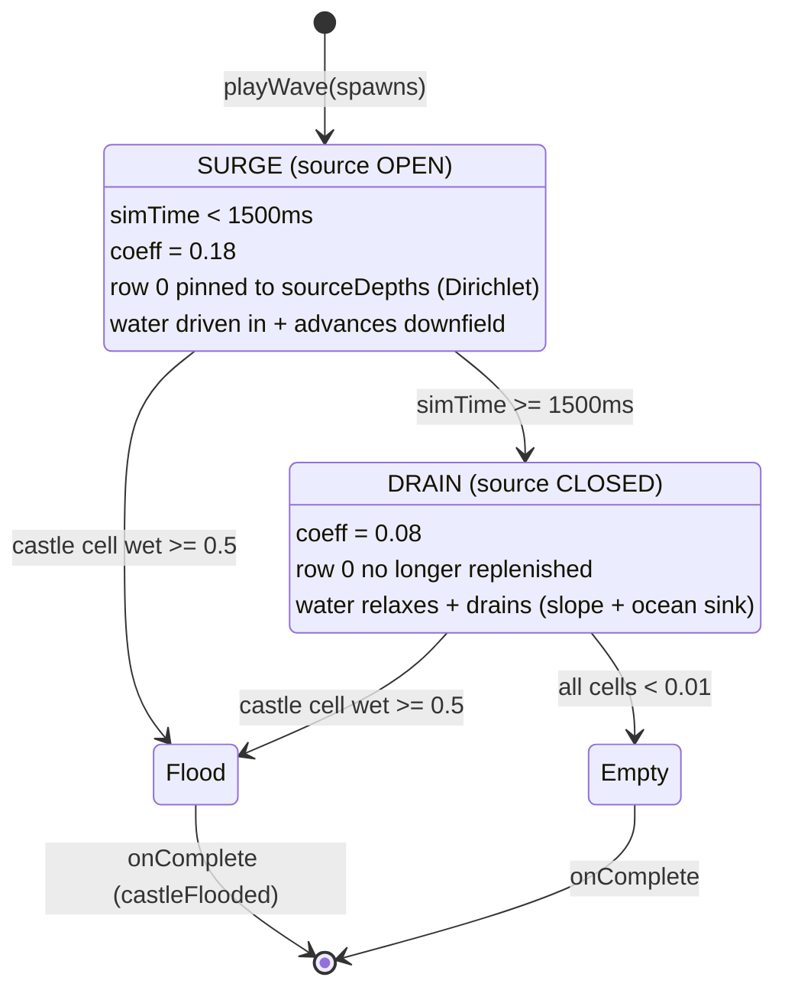
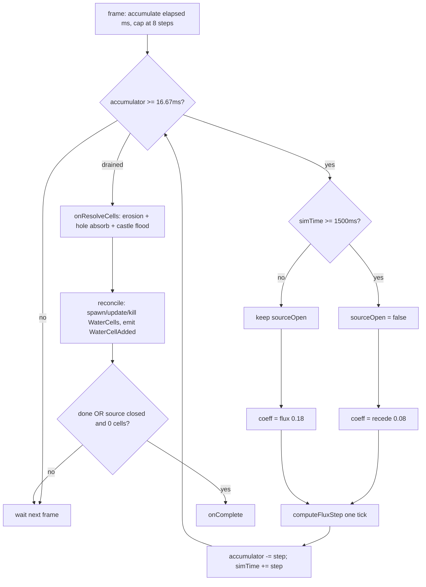
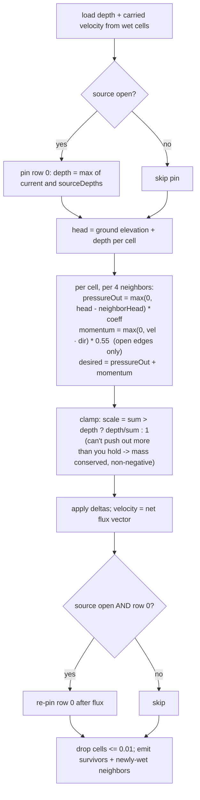

# Pressure wave field timing & sequence

Reference for how the pressure-driven water field (`PRESSURE_WATER_ENABLED`) behaves
over a single wave: source-open surge, continuous pressure equalization, and the
source-closed drain. Sourced from `src/wave/wave-dynamic-system.ts` and `src/config.ts`.

> **Key correction to the intuitive model:** there is no discrete "equalize" phase
> between source-on and drain. Pressure equalization (the flux relaxation) runs on
> **every sim tick the entire time**. The only thing that switches is a single binary,
> `sourceOpen`, gated by the surge window. The advance-then-recede arc is emergent:
> water is *injected while the source is open* and *drains once it closes*, not three
> separate stages.

## Constants (`src/config.ts`)

| Knob | Value | Role |
|---|---|---|
| `PRESSURE_SIM_STEP_MS` | `1000/60` ≈ 16.67ms | fixed sim tick (decoupled from frame rate) |
| `PRESSURE_SURGE_WINDOW_MS` | 1500 | how long the source stays open |
| `PRESSURE_FLUX_COEFF` | 0.18 | flux rate while source open (surge) |
| `PRESSURE_RECEDE_COEFF` | 0.08 | flux rate after source closes (drain, slower) |
| `PRESSURE_INERTIA_COEFF` | 0.55 | momentum term (sustains advance + overshoot) |
| `PRESSURE_DRAIN_THRESHOLD` | 0.01 | depth below which a cell is dropped |
| `PRESSURE_CASTLE_FLOOD_DEPTH` | 0.5 | wet-castle depth that ends the wave |

> These are live tuning dials; values reflect the state as of 2026-06-15. Check
> `config.ts` for current numbers.

## Lifecycle: two regimes + termination

The ocean sink (north of row 0, head 0) is **always** on. During surge the source pin
overpowers it (net inflow); once the source closes, row-0 water drains back north off
the board, which is a large part of the recede.

## Per-frame update loop (`WaveDynamicSystem.update`)

The loop runs *multiple* fixed sub-steps per rendered frame if the frame was long
(catch-up, capped at 8 steps so a stall can't explode). `simTime` only advances on
executed steps, so the 1500ms surge window is exactly 90 ticks regardless of frame rate.

## One sim tick (`computeFluxStep`) — the equalization math

"Pressure equalizing across the field" is exactly step **F→G**: every wet cell pushes
water toward lower-head neighbors at rate `coeff`, scaled so it never overdraws. That is
a relaxation toward uniform head, running continuously. It never fully equalizes during
surge because the row-0 pin holds that boundary high and the slope/ocean-sink keep
bleeding it; after the source closes it relaxes *and* empties.

## Plain-language timeline

1. **t = 0 → 1500ms (surge, coeff 0.18):** row 0 held at `sourceDepths` each tick (a
   held-open tap). Flux + momentum (0.55) drive water down the slope and laterally; the
   front advances and overshoots.
2. **t = 1500ms (switch):** `sourceOpen → false`. The tap closes; nothing replenishes row 0.
3. **t > 1500ms (drain, coeff 0.08):** same kernel, slower rate. Carried momentum lets it
   coast forward briefly, then the slope plus the always-on ocean sink pull it back; the
   field recedes. The slower coeff is deliberate so the drain does not snap out faster
   than the water came in.
4. **End:** completes the instant a castle cell is wet >= 0.5 (flood, `done`), or once
   every cell has drained below 0.01.
