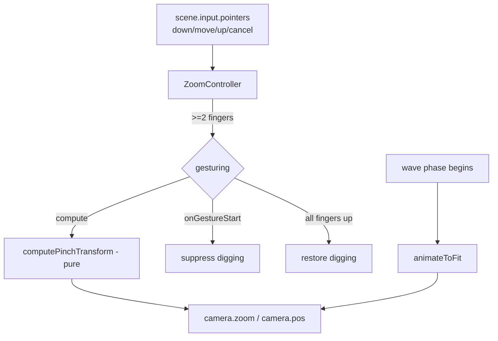

# Pinch-to-Zoom for Mobile — Design

## Goal

On small touch screens the responsive layout clamps tiles down to ~16px, which
makes individual tiles hard to tap accurately. Let mobile players **pinch to
zoom in** for precise interaction and **pan** the zoomed view, then return to a
full-board view automatically when a wave starts.

## Scope (decisions)

- **Input:** touch pinch only. No desktop wheel, keyboard, or buttons.
- **Gesture model:** two fingers pinch to zoom and drag to pan (combined,
  map-style). One finger always digs/builds — never pans.
- **Zoom range:** min `1.0` (board already fits the screen) to max `2.5`.
- **Lifecycle:** zoom/pan persist during the planning phase, then smoothly
  auto-fit back to `1.0` when the wave phase begins.
- Out of scope: panning with one finger, minimap, edge-pan, zoom-out below fit.

## Why the camera (not CSS)

The game places all actors in world coordinates that currently equal screen
coordinates (no camera transform), and input hit-testing reads `evt.worldPos`
(`src/view/single-cell-digging.ts:53`, `src/view/drag-digging.ts:154`).
Excalibur's `worldPos` already accounts for `camera.zoom` and `camera.pos`, so
zooming via the **scene camera** keeps tile hit-testing correct with no changes
to the digging strategies. A CSS transform would desync input from rendering.

Confirmed Excalibur APIs (installed version, `Camera.d.ts`):

- `camera.zoom` — `get/set number`, default `1`.
- `camera.pos` — `get/set Vector`; the world point mapped to screen center.
- `camera.zoomOverTime(scale, duration?, easing?) => Promise<boolean>`.
- `camera.move(pos, duration, easing?) => Promise<Vector>`.
- Pointer events (`PointerEvent`) carry `pointerId`, `screenPos`, `worldPos`.
- Cameras are **per-scene**, so zoom on `game`/`tide` never leaks to `title`.

## Coordinate model

Excalibur's camera transform (no rotation) is:

```
screen = (world - camera.pos) * zoom + center
world  = camera.pos + (screen - center) / zoom
```

where `center = (canvasWidth/2, canvasHeight/2)` in the layout pixel space used
by `computeLayout` (`src/config.ts`). At `zoom = 1` with `camera.pos = center`,
world equals screen — matching today's behavior. We implement this transform
ourselves in the pure math functions (rather than calling
`engine.screenToWorldCoordinates`) so the core is engine-free and unit-testable.

## Architecture

New file `src/view/zoom-controller.ts`, activated like `Hud`/`Toolbar`.



### ZoomController responsibilities

1. **Track pointers.** Maintain `Map<pointerId, Vector>` of active touch points
   from the multi-pointer receiver `scene.input.pointers` (NOT `.primary`, which
   the digging strategies use). Update on `down`/`move`, remove on `up`/`cancel`.
2. **Drive the camera.** While ≥2 pointers are down, feed the first two tracked
   points into `computePinchTransform` and assign `camera.zoom` + `camera.pos`.
3. **Suppress digging.** On entering a gesture, call an injected
   `onGestureStart()`; on exit (see lifecycle below) call `onGestureEnd()`.
4. **Auto-fit.** `animateToFit()` animates zoom→1 and pos→center.
5. **Reset.** On `deactivate`, remove all listeners and restore camera to
   `zoom = 1`, `pos = center`, and clear gesture state.

### Constructor / activate inputs (inline fields, object arg)

```ts
interface ZoomControllerOptions {
  minZoom: number;        // 1.0
  maxZoom: number;        // 2.5
  canvasWidth: number;    // LAYOUT.canvasWidth
  canvasHeight: number;   // LAYOUT.canvasHeight
  onGestureStart: () => void;
  onGestureEnd: () => void;
}
```

`minZoom`/`maxZoom` from new `config.ts` constants `ZOOM_MIN = 1.0`,
`ZOOM_MAX = 2.5`, `ZOOM_FIT_ANIM_MS = 300`.

## Gesture math (pure functions)

```ts
// Captured once when the 2nd finger lands.
interface PinchStart {
  a0: Vector;   // initial screen pos of pointer A
  b0: Vector;   // initial screen pos of pointer B
  startZoom: number;
  startPos: Vector;     // camera.pos at gesture start
  anchorWorld: Vector;  // world point under the initial midpoint
}

// anchorWorld = startPos + (mid(a0,b0) - center) / startZoom
```

```ts
function computePinchTransform(input: {
  start: PinchStart;
  a: Vector;            // current screen pos of pointer A
  b: Vector;            // current screen pos of pointer B
  center: Vector;       // canvas center
  minZoom: number;
  maxZoom: number;
  canvasWidth: number;
  canvasHeight: number;
}): { zoom: number; pos: Vector } {
  const d0 = start.a0.distance(start.b0);
  const d1 = a.distance(b);
  const zoom = clamp(start.startZoom * (d1 / d0), minZoom, maxZoom);
  const m1 = a.add(b).scale(0.5);          // current midpoint
  // Keep anchorWorld under the moving midpoint => pan + zoom in one step:
  // world = pos + (screen - center)/zoom  =>  pos = anchorWorld - (m1-center)/zoom
  const rawPos = anchorWorld.sub(m1.sub(center).scale(1 / zoom));
  const pos = clampCameraPos({ pos: rawPos, zoom, canvasWidth, canvasHeight });
  return { zoom, pos };
}
```

Anchoring the initial touched world point under the current midpoint yields both
**zoom-about-the-fingers** and **pan-by-midpoint-delta** from a single formula.

```ts
function clampCameraPos(input): Vector {
  // Half-viewport in world units; viewport shrinks as zoom grows.
  const hw = canvasWidth / (2 * zoom);
  const hh = canvasHeight / (2 * zoom);
  // Pan limit = original visible area [0..canvasWidth] x [0..canvasHeight].
  // When zoom <= 1, hw >= canvasWidth/2 so x collapses to the center.
  const x = hw >= canvasWidth / 2 ? canvasWidth / 2 : clamp(pos.x, hw, canvasWidth - hw);
  const y = hh >= canvasHeight / 2 ? canvasHeight / 2 : clamp(pos.y, hh, canvasHeight - hh);
  return vec(x, y);
}
```

Clamping to the canvas rectangle prevents panning into black void and forces a
return to the centered, full-board view as zoom approaches `1.0`.

## Digging suppression lifecycle

Digging strategies bind to `scene.input.pointers.primary` — only the first
finger reaches them. The risk: during a two-finger gesture the primary finger's
`move` events still fire and could build a scoop selection. Resolution:

- **Enter gesture** (pointer count reaches 2): call `onGestureStart()`. The
  scene wires this to `activePlanning?.lockDigging()`, which already cancels any
  in-progress selection and clears tints (`DragDigging.lock`,
  `src/view/drag-digging.ts:86`).
- **Exit gesture:** when the count drops below 2, do **not** immediately
  re-enable digging — a finger may still be down. Keep digging suppressed until
  **all** pointers are up, then call `onGestureEnd()` →
  `activePlanning?.unlockDigging()`. This prevents the lingering finger from
  starting an accidental dig.

`lockDigging`/`unlockDigging` are idempotent and already exist on
`PlanningPhase` (used by the exit dialog), so no new planning API is needed.
During the wave phase there is no active planning, so the hooks no-op via
optional chaining and pinch still zooms (harmlessly, since auto-fit runs).

## Scene integration

### LevelSession (`src/level-session.ts`)

- Add `private zoom!: ZoomController`.
- In `activateGameplayUi()` (after `toolbar.activate`), construct + `activate`
  the controller with `onGestureStart: () => this.activePlanning?.lockDigging()`
  and `onGestureEnd: () => this.activePlanning?.unlockDigging()`.
- In `cleanupGameplay`, call `this.zoom.deactivate(this)`.
- In `startPlanningPhase()`'s wave-start callback (`src/level-session.ts:220`,
  right before `void this.runWavePhase()`), call `this.zoom.animateToFit()` so
  the board is fully visible when the wave arrives.

### TideSession (`src/tide-session.ts`)

Same wiring. Tide mode runs continuous waves; call `animateToFit()` at the same
point its wave phase begins (the planning→wave handoff in tide-session).

## Constants (`src/config.ts`)

```ts
export const ZOOM_MIN = 1.0;
export const ZOOM_MAX = 2.5;
export const ZOOM_FIT_ANIM_MS = 300;
```

## Testing

Per `docs/testing.md` and the testing guidelines (prefer pure functions, no
stubbing the subject):

**Unit (`src/view/zoom-controller.test.ts`)** — exercise the pure core:

- `computePinchTransform`:
  - Fingers spreading 2x from center → `zoom` doubles (clamped to `ZOOM_MAX`).
  - Fingers pinching together → `zoom` decreases, clamped at `ZOOM_MIN`.
  - Midpoint translating with constant spread → pure pan, `zoom` unchanged.
  - Anchor invariant: the `anchorWorld` point maps back under the current
    midpoint (within float tolerance) using the forward `world→screen`.
- `clampCameraPos`:
  - `zoom = 1` collapses `pos` to canvas center on both axes.
  - `zoom > 1` clamps `pos` to `[hw, canvasWidth-hw]` so the viewport stays
    inside the canvas rect.
- A small gesture-state reducer (pointer map → enter/exit gesture transitions)
  tested directly: 1→2 pointers enters; 2→1 stays suppressed; →0 exits.

**Browser** — not required for the math. Multi-touch is hard to synthesize
reliably in the harness; the pure functions carry the logic. If a smoke test is
wanted, assert `camera.zoom` changes after injecting two synthetic `down` events
plus a `move`, but treat it as optional.

## Verification

Each implementation step ends with `node --run static-check` which runs the full verification suite.

## Docs

Update `docs/gameplay.md` controls/input section to document pinch-to-zoom and
two-finger pan on touch devices, in the same change as the implementation.
