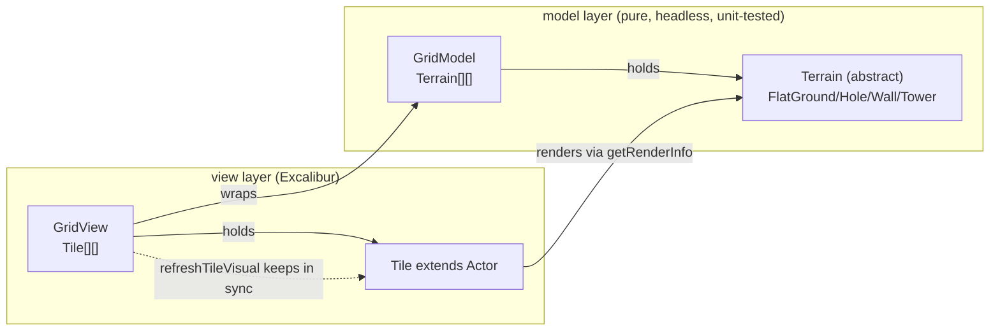

# Terrain → Excalibur Actor Migration (WIP Design)

> **Status: WORK IN PROGRESS — paused.**
> This is a brainstorm-stage design capturing decisions and findings so the
> session can resume cold. **Blocked on a prerequisite:** the wall-tier
> gameplay refactor (discrete tier tools) should land first — see
> [Dependency: wall-tier refactor](#dependency-wall-tier-refactor).

## Goal

Turn the terrain implementations (`FlatGround` / `Hole` / `Wall` / `Tower`)
into formal Excalibur `Actor`s to:

1. Use **colliders** for wave/terrain interaction instead of hand-rolled geometry.
2. **Reduce re-implemented primitives** — position/layout math, model/view
   duplication, neighbor/adjacency logic.

All four pain points were confirmed in scope.

## Decisions locked so far

| # | Decision | Choice |
|---|----------|--------|
| 1 | Re-implementation pain to kill | All four: wave/terrain hit detection, position/layout math, model/view duplication, neighbor/adjacency |
| 2 | Determinism vs colliders | **Colliders become source of truth** for wave/terrain interaction |
| 3 | Pre-planning layer | **Spawn dumb, physics decides all** — delete per-row depletion forecast (`WaveSegment.planWaveCells`) |
| 4 | Reach indicator | **Drop it** — no exact forecast under physics-native model |
| 5 | Collider role | **All `CollisionType.Passive`** sensors; a pure resolution fn reads type+elevation+wave depth and decides block/overtop/absorb. Colliders detect *when*; data decides *what*. |
| 6 | Terrain ↔ Actor relationship | **`Terrain extends Actor`** directly (each subclass is an Actor) |
| 7 | Test strategy | **Mostly browser tests** for the integrated terrain+grid+wave system |
| 8 | `GridView` / `Tile` | **Collapse into the actor grid** — delete both; `GridModel` becomes the single grid container |
| 9 | Wall tier representation | **Discrete tier classes/field** (e.g. `WallT1..N`), each a distinct type — placement is replace-with-known-type, not height arithmetic |

### Key reconciliation (decision 2/5 nuance)

"Colliders as source of truth" does **not** mean physics math replaces all
logic. A collider answers *"this wave segment overlaps this terrain cell now"*
(replacing the geometric row-entry math). The **outcome** — block vs overtop vs
absorb — still compares wave `depth` to terrain `elevation`, which are data
attributes, not screen geometry (this is a top-down grid: the y-axis is travel
direction, elevation is a *simulated* vertical dimension). So the plan is:
**collision event → invoke a pure `resolveWaveHit()` function → apply result.**
That keeps the decision logic unit-testable even though a collision triggers it.

## Current architecture (as found)

Three parallel objects per cell, hand-synced:



Key facts verified in code:

- **`src/model/terrain/terrain.ts`** — abstract `Terrain`: `attach(grid,col,row)`,
  `get neighbors` (via `NeighborGrid.neighborsOf`), `connectsTo`, `elevation`,
  `onWaterHit`, `applyHits`, `applyDelta`, `resetHits`, `serialize`,
  `getRenderInfo()` (returns sprite/tint/`customDraw`). **No Excalibur import
  except types** — fully headless.
- **`src/view/tile.ts`** — `Tile extends Actor`, 1:1 with cells, holds a
  `terrain` ref, caches the `customDraw` `Canvas` keyed by `cacheKey`.
- **`src/view/grid-view.ts`** — `GridView` mirrors `GridModel` with a `Tile[][]`;
  every mutation calls `refreshTileVisual(col,row)` (+ neighbors, because wall/hole
  edge rendering depends on neighbors).
- **`src/model/grid-model.ts`** — owns `Terrain[][]`, implements `NeighborGrid`,
  routes all assignment through `setCell` (which calls `terrain.attach`), pool
  detection (flood fill over `Hole`s), `placeTower`, sand redistribution,
  serialization.
- **Wave runtime** — `WaveSegment extends Actor` already has a
  `CollisionType.Passive` collider **but does not use collisions**; it computes
  `handleTileEntries` from `pos.y` and reads `grid.getElevation()` directly,
  emitting events. `WaveEventApplier` writes events back into `GridView`.
  `WaveActorRuntime` spawns/coordinates segments.
- **Pre-planning** — `wave-spawner.ts` calls `generateWaveCurve` (in
  `wave-simulation.ts`) for the **initial per-column wave shape** (peaks/valleys);
  that stays. `WaveSegment.planWaveCells` does the **per-row depletion forecast**;
  that is what "spawn dumb" deletes. `flow-field.ts` / advance-recede sim feeds
  `replay-wave.ts` and the old reach indicator.

### The `applyDelta` swap wrinkle (why decision 9 matters)

`Terrain.applyDelta(amount)` returns a **new** `Terrain`, often a different
subclass: digging a `Wall` past 0 → `Hole`; raising a `Hole` past 0 → `Wall`;
eroding to 0 → `FlatGround`. `GridModel.setCell` swaps the instance. For plain
objects this is trivial; for **Actors** every type change means
remove-old-actor + add-new-actor (re-wire pos, col/row, collider, z).

This arithmetic-with-implicit-type-crossing is the single fiddliest part of the
migration. **The wall-tier refactor dissolves it**: discrete tier tools turn
edits into explicit "replace this cell with terrain type X," which maps 1:1 onto
"remove old actor, add new actor." That is why tiers go first.

## Proposed object model (post-migration)

One actor per cell. `Terrain extends Actor`; each subclass owns position,
a `Passive` box collider, self-rendering (today's `getRenderInfo.customDraw`
moves into the actor's graphics + cache), elevation/erosion data, serialization.
`Tile` deleted. `GridView` deleted. `GridModel` becomes the single container:
holds the actor array, wires neighbors, adds/removes actors to/from the `Scene`.

```mermaid
flowchart LR
  subgraph grid["GridModel (single container)"]
    A["TerrainActor[][]<br/>(FlatGround/Hole/Wall*/Tower extends Actor)"]
  end
  W["WaveSegment (Actor)"]
  R["resolveWaveHit() — pure, tested"]
  W -->|onCollisionStart (Passive)| A
  A -->|reads type+elevation+depth| R
  R -->|block/overtop/absorb result| A
  grid -->|add/remove on type-swap| Scene
```

Type-swap approach: **(A) mutate-in-place + swap-on-type-change** — staying the
same type mutates the existing actor; crossing a type boundary removes the old
actor and spawns the new one. (Decision deferred to resume — see open questions —
but tiers make explicit replacement the norm, favoring A.)

## Dependency: wall-tier refactor

**Do this first, as a separate change.** Rationale:

- The tier redesign and the actor migration rewrite the **same surfaces**:
  `validActionsFor`, `TerrainEditor.applyAction`, `ToolType`, `Wall.applyDelta`,
  `GridModel.setElevation`. Migration-first = double rewrite.
- Tiers convert `applyDelta` arithmetic into explicit placement, which is exactly
  what makes the actor-swap clean. Tiers simplify the migration; the migration
  does nothing for tiers — dependency is one-directional.

Wall tiers become **discrete types** (decision 9). When resuming, the migration
should target the post-tier model, where walls are placed/upgraded as known
types rather than incremented.

## Blast radius (files to change)

- **Delete:** `src/view/tile.ts`, `src/view/grid-view.ts`,
  `WaveSegment.planWaveCells` (+ travel-forecast bits), reach-indicator code in
  `src/view/planning-phase.ts`.
- **Rewrite:** `src/model/terrain/*` (each → Actor), `src/model/grid-model.ts`
  (single container + scene add/remove), `src/wave/wave-segment.ts` (collision-
  driven), `src/wave/wave-event-applier.ts` (now targets actor grid),
  `src/wave/wave-actor-runtime.ts`.
- **Touch:** `src/view/terrain-editor.ts` (reads `grid.model`, mutates via
  `setElevation`/`placeTower`), `src/level-session.ts`, `src/tide-session.ts`,
  `src/view/wave-renderer.ts`.
- **Re-evaluate:** `src/model/wave-simulation.ts` (keep `generateWaveCurve`,
  drop depletion forecast usage), `src/model/flow-field.ts`,
  `tools/replay-wave.ts` (loses meaning under physics-native waves — decide
  whether to retire or repoint).

## Testing strategy

Integrated terrain+grid+wave moves to **browser tests** (decision 7). Preserve
fast unit coverage where possible by keeping `resolveWaveHit()` and terrain
data/serialization methods pure and constructible headlessly in jsdom (you can
`new Wall()` and assert data without an Engine; only collision-firing needs the
loop). Existing unit suites affected: `wall.test.ts`, `flat-ground.test.ts`,
`grid-model.test.ts`, `grid-view.test.ts` (deleted), `wave-simulation.test.ts`,
`wave-event-applier.test.ts`, `wave-actor-runtime.test.ts`.

Per repo rules: every implementation task must end with `node --run static-check`
(or `node --run test:unit` for unit-only iterations) passing before it's "done."

## Open questions to resolve on resume

1. **Type-swap mechanism** — confirm (A) mutate+swap vs (B) single actor with
   behavior strategy, given the final tiered model. Tiers favor (A); re-confirm.
2. **Neighbor/adjacency via colliders?** — decision 1 included this, but for a
   *static* grid, neighbors are trivially `cells[row±1][col±1]`. Recommend
   **keeping array-based neighbor lookup** and reserving colliders for the
   wave↔terrain dynamic interaction; using collider queries for static grid
   adjacency is likely over-engineering (raise with user).
3. **Wave depletion tuning** — "spawn dumb" needs the live depth-depletion
   constants (slope, absorb, block thresholds) retuned now that there's no
   forecast; capture target feel.
4. **`replay-wave.ts` fate** — retire, or rebuild as an actor-driven harness?
5. **Castle tile** — `CastleTile` interplay with the new actor grid (currently a
   `Tile` subclass).
6. **Sand layer** — `WaveEventApplier` also drives `SandLayer.coverCell`; confirm
   it stays as-is against the actor grid.

## Resume checklist

- [ ] Wall-tier refactor merged (discrete tier types).
- [ ] Re-read this doc + the post-tier `terrain/*` and `terrain-editor.ts`.
- [ ] Resolve open questions 1–2 with the user.
- [ ] Write the full implementation plan (phased: terrain→Actor, then grid merge,
      then collision-driven waves, then delete forecast/reach-indicator).
