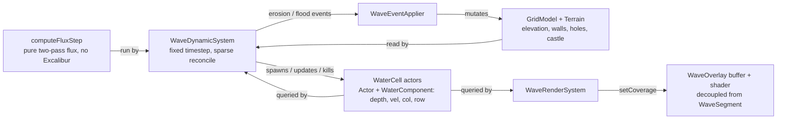
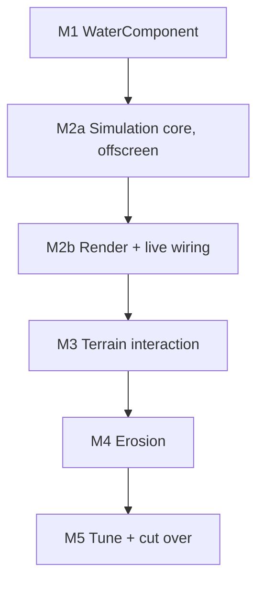

# Pressure-Driven Water Simulation: Execution Overview

Companion to `2026-06-12-pressure-water-simulation-design.md`. That document
holds the aspirational design; this one lays out how we get there in small,
safely shippable milestones, with acceptance criteria and risks for each.

## Guiding principles

- **Integrate early, not at the end.** The sim/render contract (the
  `WaterComponent` shape) is the thing most likely to rot if built in isolation,
  so we lock it with a thin end-to-end slice as soon as possible and deepen each
  layer in place.
- **Two systems, decoupled through components.** A simulation `System` owns the
  flux logic and writes `WaterComponent` data. A separate render `System` reads
  `WaterComponent` data and updates the overlay actor. Neither knows about the
  other; the components are the only contract. The sim system never touches
  pixels, which keeps it headless-testable.
- **Reuse the surviving infrastructure.** `Terrain` actors + `GridModel`, the
  `generateWaveCurve` lateral profile, sand/wall/hole/tower/castle rules, and
  `WaveEventApplier` feedback all stay. The deprecated deterministic solver
  (`flow-field.ts`, `simulateWave`) goes.
- **Each milestone leaves the game working** and passes `node --run
  static-check` (lint, typecheck, unit, knip, browser).

## Architecture target

Each occupied water cell is a lightweight `WaterCell` scene actor carrying a
`WaterComponent`; the cell set is sparse and reconciled (spawn/update/kill) every
frame. The flux math is a pure kernel (`computeFluxStep`) the System runs in
memory each fixed step, so it is unit-testable without booting a `World`. There
is no separate dense field object: the actors (their components) are the source
of truth, read once and written once per frame around the in-memory sub-steps.

## Milestones

### M1: WaterComponent foundation (no behavior change)

Introduce a `WaterComponent` and make it the home for a water cell's depth and
velocity. Attach it to the existing `WaveSegment` so `currentDepth` is backed by
the component. The game plays identically; this proves the ECS container and
locks the data shape the later systems will share. The overlay is left untouched:
once `currentDepth` delegates to the component, the overlay's existing
`actor.currentDepth` read is already component-backed. Making that read explicit
is folded into M2 with the render System. (`WaterComponent` is a behavior-free
data holder, so it carries no unit tests; M2 renames `velocity → vel` and adds
`col`/`row` when the systems start reading it.)

- **Acceptance criteria**
  - `WaterComponent` exists with `depth` and `velocity` fields.
  - Every `WaveSegment` owns a `WaterComponent`; `segment.currentDepth` reads and
    writes through it (verified both directions).
  - The overlay is unchanged and still renders correctly.
  - All existing tests pass unchanged; `node --run static-check` is green.
- **Risks**
  - Constructor ordering: `currentDepth` is read during `WaveSegment`
    construction, so the component must be created before those reads. Low risk,
    contained to one constructor.
  - Excalibur 0.32 component lifecycle quirks. Mitigated by the existing browser
    test harness exercising real actors.

### M2a: Simulation core, flat ground (offscreen, not wired)

Detailed plan: `2026-06-12-pressure-water-m2a-simulation-core.md`.

Stand up the simulation and prove it without rendering anything. Water cells
become sparse `WaterCell` scene actors (`Actor` + `WaterComponent`, nothing else),
spawned and killed as cells wet and drain. One `WaveDynamicSystem` owns the
simulation: each fixed sim step it queries the live `WaterComponent`s, runs a
**pure flux kernel** (`computeFluxStep` — two-pass, mass-conserving, the home of
the stability/reach unit tests), and reconciles the result back onto the actors.
`WaterComponent` is the only sim↔render contract and is defined here; there is no
separate dense field object. No mode constructs the system yet, so the game is
unchanged.

- **Acceptance criteria**
  - Mass conservation, non-negativity, and no checkerboard oscillation verified in
    headless unit tests of the pure kernel (no `World`, no rendering).
  - Reach converges to approximately `D / s` rows (`D` = source depth,
    `s = TERRAIN_SLOPE`); drains to empty after the source closes.
  - `WaveDynamicSystem` spawns/updates/kills `WaterCell` actors and fires
    `onComplete` when no water remains (browser test).
  - Default behavior is unchanged (no live path); static-check green.
- **Risks**
  - **Highest-risk milestone.** Flux stability (single `coeff ≤ 0.25` knob,
    per-cell total-outflow clamp) and mass conservation. Mitigated by the pure
    kernel and its headless tests written first.
  - Frame-rate coupling. Mitigated by a fixed simulation timestep (the System's
    accumulator) decoupled from render delta.
  - Deferred entity add/remove desyncing sub-steps. Mitigated by reading the query
    once per frame and reconciling actors once per frame, with sub-steps running
    the pure kernel in memory.

### M2b: Render + live wiring, flat ground (flagged, live)

Detailed plan: `2026-06-12-pressure-water-m2b-render-and-wiring.md`.

Make the M2a simulation visible and live. First, `WaveOverlay` is **decoupled
from `WaveSegment`** (it becomes a buffer + shader driven by an injected coverage
provider for the legacy path, or `setCoverage` for the field path), so the field
path needs no `instanceof WaveSegment` and the M5 deletion of `WaveSegment` is
clean. A `WaveRenderSystem` reads `WaterComponent`s, rasterizes a 2D depth field,
and drives the overlay through the existing shader. `WaveFieldRuntime` wires both
systems into Tide behind `PRESSURE_WATER_ENABLED`, mirroring `WaveActorRuntime`'s
`playWave` contract. Untuned but end-to-end and on screen; the sim/render contract
is locked.

- **Acceptance criteria**
  - `WaveOverlay` no longer references `WaveSegment`; legacy rendering is
    pixel-identical (driven by `WaveActorRuntime`'s coverage provider).
  - Behind the flag, a wave advances inland from a held top-row source and recedes
    when released, on flat ground, in Tide; the wave ends when no `WaterComponent`
    actors remain.
  - Default (flag off) path is unchanged; static-check green.
- **Risks**
  - Overlay-decoupling / rasterizer regressions. Mitigated by the existing
    `buildCoverageData` tests, the legacy visual baseline, and screenshot capture.
  - 2D field render coordinate mismatches (the `+1` ocean band offset). Mitigated
    by the rasterizer unit tests and the flag-on visual baseline.

### M3: Terrain interaction in the field

Teach `WaveDynamicSystem`'s flux kernel about terrain via `GridModel`
grid-indexed lookups: walls block and overtop by elevation, holes pool with
finite capacity and accumulate `puddleDepth`, the castle triggers a flood. No
physics colliders. (`WaveFieldRuntime` starts wiring `WaveEventApplier` here.)

- **Acceptance criteria**
  - Walls block water below their elevation and are overtopped above it, per
    `WALL_LEVEL_ELEVATION`.
  - Water spreads laterally around walls (around-the-obstacle flow visible
    in-app).
  - Holes fill to finite capacity and stop absorbing; `puddleDepth` updates.
  - Castle flooding is detected and ends the level as today.
  - Headless tests cover block/overtop/pool/castle using boards rebuilt from
    debug JSON; static-check green.
- **Risks**
  - Hole pooling math is subtle (the old solver had dedicated pool-group fill
    logic). Risk of regressing pooling feel. Mitigated by fixture-based tests.
  - Lateral spread tuning interacts with flux stability from M2.

### M4: Erosion via flux projection

Drive wall and tower erosion from the water velocity vector projected onto the
wall face: a frontal term (flux into the face) and a smaller shear term (flux
parallel past it). Emit the existing event vocabulary so `WaveEventApplier`
mutates terrain and redistributes sand unchanged.

- **Acceptance criteria**
  - A direct frontal hit erodes a wall faster than a glancing/parallel hit, with
    a continuous gradient in between.
  - Wall HP (`WALL_LEVEL_HP`) and tower hit counts
    (`TOWER_HITS_PER_EROSION`) are respected.
  - `WaveEventApplier` integration produces the same terrain mutation and sand
    redistribution behavior it does today.
  - Headless tests for direct vs shear erosion magnitudes; static-check green.
- **Risks**
  - Erosion coefficient tuning is a feel problem; numbers will need iteration.
  - Mapping continuous per-frame flux onto discrete hit-count erosion needs an
    accumulation rule. Mitigated by making it explicit and tested.

### M5: Tune, generalize, and cut over

Tune front sharpness and the lateral source profile (mapping
`generateWaveCurve`'s multi-peak shape onto per-column source depth). Enable both
Classic and Tide. Remove the flag and delete the scripted `WaveSegment` surge and
`WaveActorRuntime` (at which point `WaterCell` is the only water actor and the
`Water`/`Wave` naming can converge). Delete the deprecated solver if not already
removed in M1.

- **Acceptance criteria**
  - Both modes run on the field simulation with the flag removed.
  - Waves arrive unevenly across columns and interact with terrain sideways.
  - Front feel is acceptable (subjective sign-off plus screenshot review).
  - Old scripted-surge code paths are deleted; static-check green; no dead code
    flagged by knip.
- **Risks**
  - Tide's continuous cadence stresses the source/recede cycle harder than
    Classic; latent bugs may surface here. Mitigated by piloting one mode first
    in M2 to M4.
  - Deleting the old path is irreversible in spirit; do it only once the field
    path is proven in both modes.

## Sequencing and dependency

M1 is independent and already landed. M2a carries the bulk of the technical risk
(the flux numerics) and is proven headlessly before M2b puts it on screen; review
M2a carefully before M2b and M3 to M4 build on it.

## Open questions carried across milestones

Tracked in the design doc: front sharpness/feel, exact flux stability bounds,
the deterministic timestep harness shape, the lateral source profile mapping,
shader integration details, and erosion coefficient values.
