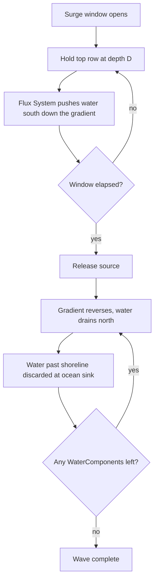
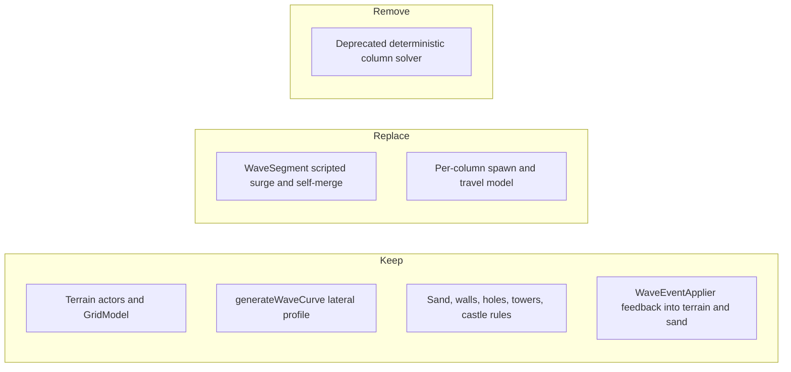

# Pressure-Driven Water Simulation: High-Level Design

Status: Aspirational design. Captures the decisions reached while reviewing
`docs/notes/proposal-water-pressure.md`. This document describes the target
direction and the principles behind it. It deliberately does not prescribe an
implementation; milestones and execution detail live separately.

## Motivation

Today the wave is a per-column scripted surge. Each `WaveSegment` actor
(`src/wave/wave-segment.ts`) spawns at the top of a column, moves south under
its own `vel`, computes its own grid position from pixel coordinates
(`getGridLoc`), pre-plans the cells it will cover (`planWaveCells`), and merges
with other segments on physical collision (`mergeWith`). Lateral spread, pooling,
and recede are either faked or absent, and a large amount of bespoke geometry is
re-implemented inside the actor.

We want water that behaves like water: it advances inland over the sloped beach,
spreads sideways around walls and trenches, pools in low ground, and recedes back
to the ocean, all emerging from a single rule rather than from per-column scripts.

The legacy deterministic column solver (`src/model/flow-field.ts` and the
`simulateWave` path in `src/model/wave-simulation.ts`) is already marked
deprecated and is out of scope to preserve. `generateWaveCurve` and the
`WallErosionEvent` type remain in use and will be retained or relocated.

## Core decision: a pressure-gradient field over ECS

Water is modeled as a field of per-cell volumes, not as moving bodies. The
driving force is hydrostatic pressure, expressed as total height:

```
total height = ground elevation + water depth
```

Water flows from high total height to low total height. The beach slope
(`TERRAIN_SLOPE`, currently 0.5 per row in `src/config.ts`) plus per-cell terrain
offsets from the existing `Terrain` actors define the ground; water depth is the
dynamic part. This is the same elevation blend the codebase already uses
(`effectiveElev = terrainSlope + rawElev`), now made the engine of motion instead
of a lookup consumed by a scripted surge.

The simulation rides on Excalibur's ECS, which we treat as the native primitive
for this work:

- A `WaterComponent` holds the data for one occupied cell: its grid coordinate,
  its depth, and a velocity/flux vector.
- A flux `System` runs the rule each tick: read each water cell's cardinal
  neighbors, compute total-height differences, and move depth accordingly.

Excalibur's physics and collision system is intentionally not used for water.
On a grid, "what terrain is here" is a direct, exact cell lookup through
`GridModel` (`getCell`, `getElevation`, `isCastle`, `neighborsOf`), not a contact
event. Colliders would add hundreds of bodies on a flooded board and still not
answer the questions the simulation actually asks. Collision detection is
reserved for things that move freely in the future (debris, enemies), not grid
water.

## Transfer, not merge

Because every cell is an independent entity and depth simply flows between
neighbors, the concept of two water bodies "merging" disappears. When water
spreading around both sides of a wall rejoins, the cells on the far side just
accumulate depth and the surface equalizes. There is no absorb-and-kill, no
momentum-blend tiebreak, no collision pair to resolve. A cell "dissipates via
depth": when its depth drains below a small threshold it is removed.

The wave is over when no `WaterComponent` entities remain. Querying the live set
each tick is the natural terminus signal, replacing the current promise-based
`playWave` resolution in `WaveActorRuntime`.

## Wave generation: a sustained ocean source

A wave is produced by holding the top row (the ocean boundary) at a high depth
for a surge window, like opening a tap. As water spreads south the source keeps
refilling the top, sustaining a pressure head that pushes water inland. When the
window closes, the head is gone, the slope now dominates the gradient, and water
naturally drains back north to an ocean sink where it is discarded.

This is a boundary condition, not a one-shot slug. A slug would diffuse and
stall; a held head sustains advance. The steady-state behavior is clean and
matches today's intuition:

- With held depth `D` and slope `s`, each row settles one slope-step shallower
  than the one north of it (`D`, `D - s`, `D - 2s`, ...).
- Water advances until depth runs out against the slope, reaching `D / s` rows
  inland. With `WAVE_HEIGHT_START = 4` and `s = 0.5` that is 8 rows, matching
  current reach.
- Walls fall out for free: water only crosses a cell when the local depth
  exceeds that cell's elevation offset.

### Strength and duration are independent knobs

A key decision: wave threat and wave length are controlled separately.

- Source depth `D` controls threat. It sets reach (`D / s`), decides which wall
  heights get overtopped, and steepens the gradient so a taller head drives
  faster flow. Bigger `D` means deeper, faster, harder-hitting.
- The surge window controls how long the level lasts and is kept roughly fixed
  across waves.

Because front travel time scales as roughly `(D / s) / (flow speed proportional
to D)`, which is approximately independent of `D`, a single fixed surge window
serves small and large waves alike. Bigger waves become violent rather than long,
so level duration stays bounded as difficulty climbs.



## Erosion: flux projection, direct versus shear

Wall and tower erosion is driven by the water's flux vector relative to the wall
face, which only the flux `System` knows:

- Direct hit: water in the cell north of a wall pushes south into the wall face.
  Flux is aligned with the contact direction, producing full erosion.
- Shear hit: water running south past a wall in the adjacent column pushes
  parallel to the wall face, producing a much smaller shear erosion.

Conceptually, erosion on a wall is the sum of a frontal term (flux into the face)
and a parallel term (flux past the face) with a much smaller shear coefficient.
A wave arriving at an angle lands somewhere in between, for free. This makes the
velocity vector load-bearing for gameplay, rather than the cosmetic-only role the
original proposal assigned it.

Existing mechanics this must preserve: leveled wall blocking heights
(`WALL_LEVEL_ELEVATION`), overtopping when depth exceeds elevation, wall HP and
erosion (`WALL_LEVEL_HP`), tower erosion after `TOWER_HITS_PER_EROSION`, hole
pooling with finite capacity and `puddleDepth` accumulation, and the castle loss
condition. These are richer than the original proposal's `isSolid` boolean and a
constant absorption rate, and the field model must continue to express them.

## What stays, what goes



The terrain layer, sand economy, and the event feedback that mutates terrain and
redistributes sand (`WaveEventApplier`) remain. The actor-driven scripted surge
is replaced by the field simulation. The deprecated solver is removed.

## Open questions

These are acknowledged unknowns to resolve during implementation and tuning, not
blockers on the direction.

- Front sharpness. Pure hydrostatic relaxation produces a rounded, diffusive
  front. How much the velocity/inertia term needs to sharpen the leading edge to
  feel like a wave is a tuning and feel question.
- Flux stability. The per-tick update must conserve mass and avoid checkerboard
  oscillation. This implies a total-outflow clamp per cell and a step-size bound,
  details to be worked out against a fixed simulation timestep.
- Determinism and testing. The current game is deterministic and tested via
  precomputed frames. A field simulation needs a deterministic fixed-timestep
  harness so behavior is reproducible and unit-testable.
- Lateral source profile. How `generateWaveCurve`'s multi-peak shape maps onto
  the held-source depth across columns, so waves still arrive unevenly and
  interact with terrain sideways.
- Rendering. How per-cell depth and velocity feed the water shader, and how that
  reconciles with the existing overlay-based rendering.
- Erosion coefficients. The relative magnitudes of direct versus shear erosion,
  and how they map onto existing wall HP and tower hit counts.
