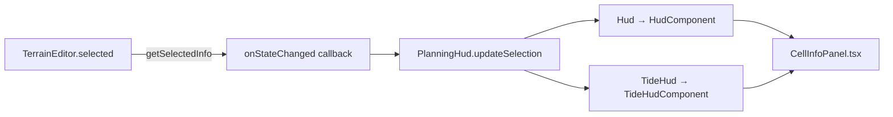

# Cell Info Panel — Design

Date: 2026-06-15

## Summary

When a cell is selected during planning, show information about that cell in the
top-right HUD panel: terrain type, height, and type-specific stats (wall HP, hole
water, tower wear). This replaces the current action-verb hint ("Selected - dig /
wall"), which duplicates the toolbar and was found unhelpful in play.

## Decisions

- **Trigger**: selection only. No hover preview.
- **Right panel becomes pure cell info.** The action-verb hint and transient
  status strings ("Sending wave...", "Wall maxed", "Click a cell to start
  planning") are dropped. The toolbar already shows which tools are valid and
  their sand costs.
- **Stats are numbers only** (no progress bars).
- **Planning phase only.** During the wave phase the editor is locked and the
  planning HUD is hidden, so the panel naturally disappears. No live wave wiring.
- **Both Classic and Tide modes**, via the shared `PlanningHud` interface and
  `TerrainEditor`.
- **Each cell defines its own data.** The presentation shape is an open
  `{ title, stats[] }` with an arbitrary-length stat list; nothing in the view
  assumes a fixed set of fields.

## Data model

Each terrain owns how it describes itself, paralleling its existing `serialize()`
(which stays debug-JSON-shaped). Display needs derived/friendly values like max
HP and a human title, so `describe()` is separate.

In `src/model/terrain/terrain.ts`:

```ts
export interface CellStat {
  label: string;
  value: string;
}

export interface CellInfo {
  title: string;        // e.g. "Wall L2", "Hole", "Tower", "Flat ground"
  stats: CellStat[];    // ordered rows, rendered top-to-bottom
}

// on abstract class Terrain
abstract describe(): CellInfo;
```

The generic `{ title, stats[] }` shape (rather than a discriminated union) keeps
each terrain the single source of truth for its own labels and formatting, lets a
cell return however many rows it wants, and makes adding a future field a one-line
change in one file. The React component blindly maps whatever rows it is given.

### Per-type content (numbers only)

| Type | Title | Stats |
|------|-------|-------|
| Flat ground | `Flat ground` | Height: `0` |
| Hole | `Hole` | Depth: `2`, Water: `1.5 / 2` |
| Wall | `Wall L2` | HP: `32 / 45`, Height: `10` |
| Tower | `Tower` | Height: `15`, Wear: `4 / 10` |

Formatting details:

- **Hole** shows depth as a positive number (`Depth: 2`, reads better than
  `height -2`). Water is `puddleDepth / depth`. Fractional values round to one
  decimal; whole numbers show plain (`2`, not `2.0`).
- **Wall** max HP comes from `WALL_LEVEL_HP[level - 1]` (15/45/90/150).
- **Tower** wear is `hitCount / TOWER_HITS_PER_EROSION` (`/ 10`). Shows `0 / 10`
  when undamaged so the layout is stable.
- **Castle cells** are non-selectable, so they never produce a `CellInfo`.

## Wiring



- **`PlanningHud` interface** (`planning-phase.ts`): replace
  `updateState(text: string)` with `updateSelection(info: CellInfo | null)`.
- **`TerrainEditor`**: replace `getStateText(): string` with
  `getSelectedInfo(): CellInfo | null` — returns `null` when nothing is selected,
  else `grid.getCell(col, row).describe()`. All existing call sites already fire
  `onStateChanged` on select / move / edit; only the payload changes.
- **`PlanningPhase.activate`**: `onStateChanged: () =>
  this.hud.updateSelection(this.editor.getSelectedInfo())`.
- **Classic `Hud`**: store `selection: CellInfo | null`, add `updateSelection`,
  pass to `HudComponent`. The existing `planning` object still drives the left
  panel (level + wave text) and lifecycle; selection is independent state.
- **`TideHud`**: drop `stateText`, add `selection`, pass to `TideHudComponent`.
- **React**: extract a shared `CellInfoPanel.tsx` rendering the `CellInfo` (title
  + stat rows) when present, else a dim idle prompt `Select a cell`. Both
  `HudComponent` and `TideHudComponent` render it in their right panel, reusing
  the existing `.hud-panel` styling.

### Consequence

The transient `"Sending wave..."` text in `PlanningPhase.handleEdit` and the
no-action strings from `getStateText` go away. The empty-selection case becomes
the idle prompt; the wave visibly starting is its own feedback.

## Testing

Unit tests (jsdom Vitest project, since terrain imports Excalibur):

- Co-located terrain `*.test.ts`: assert `describe()` for representative states —
  fresh vs damaged wall (HP reflects hits), hole with/without puddle and
  fractional water, tower with accumulated wear, flat ground. Partial matching
  (`toMatchObject`), not brittle deep-equals.
- `terrain-editor.test.ts`: `getSelectedInfo()` returns `null` when nothing
  selected and the selected cell's `describe()` otherwise. Inject a test grid
  double rather than stubbing the editor.

Optional browser smoke test (`*.browser.test.ts`): select a cell, assert the
panel renders the title and a stat row, reusing the shared browser fixture. Add
only if unit coverage feels thin.

Verification: `node --run static-check` must pass.

## Docs to update

- `AGENTS.md` core-files list: note `CellInfoPanel.tsx` and that the right HUD
  panel shows selected-cell stats.
- `docs/gameplay.md`: a line under the planning-phase description that selecting a
  cell shows its stats (height, wall HP, hole water, tower wear).
