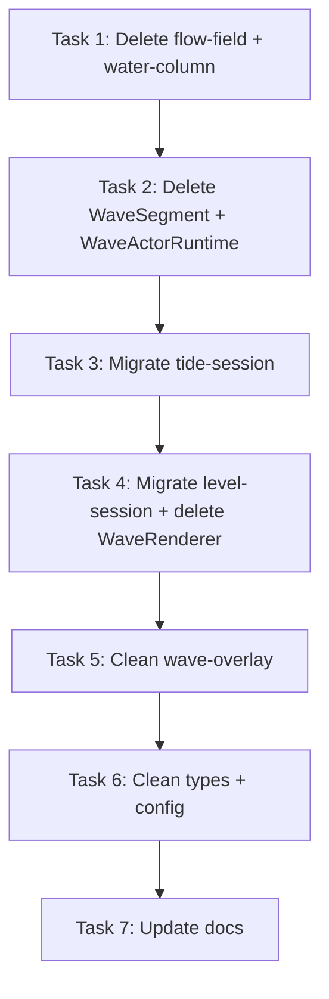

# Pressure Water Cleanup: Remove Legacy Wave Code

> **For Claude:** REQUIRED SUB-SKILL: Use superpowers:executing-plans to implement this plan task-by-task.

**Goal:** Remove `PRESSURE_WATER_ENABLED` feature flag and all dead legacy wave code now that the pressure-driven field simulation is the only path.

**Architecture:** The pressure-driven water simulation (M1-M5) replaced the old actor-driven `WaveSegment` + deterministic `flow-field.ts` solver. The flag is hardcoded `true`. This cleanup deletes all legacy code paths, promotes the field path to unconditional, and migrates `level-session.ts` (Classic mode) from `WaveActorRuntime` to `WaveFieldRuntime`.

**Tech Stack:** TypeScript, Excalibur.js, Vitest

---

## Inventory

### Files to delete entirely

| File | Reason |
|------|--------|
| `src/wave/wave-segment.ts` | Legacy actor-driven wave segment |
| `src/wave/wave-segment.browser.test.ts` | Tests legacy segment |
| `src/wave/wave-actor-runtime.ts` | Legacy wave runtime |
| `src/wave/wave-actor-runtime.test.ts` | Tests legacy runtime |
| `src/wave/wave-visual-capture.browser.test.ts` | Tests legacy segment actors |
| `src/model/flow-field.ts` | Deprecated deterministic solver |
| `src/model/flow-field.test.ts` | Tests deprecated solver |
| `src/model/water-column.ts` | Only used by flow-field.ts |
| `src/model/water-column.test.ts` | Tests water-column |
| `src/view/wave-renderer.ts` | All remaining methods are legacy (see task 4) |
| `src/view/wave-renderer.test.ts` | Tests only legacy methods |

### Files to partially clean

| File | What changes |
|------|--------------|
| `src/tide-session.ts` | Remove `PRESSURE_WATER_ENABLED` conditional, delete `WaveActorRuntime` field + imports, collapse to `WaveFieldRuntime` only |
| `src/level-session.ts` | Replace `WaveActorRuntime` with `WaveFieldRuntime` (Classic mode was never migrated) |
| `src/config.ts` | Delete `PRESSURE_WATER_ENABLED`, `WAVE_ROW_DELAY_MS`, `WAVE_RECEDE_ROW_DELAY_MS`, `WATER_RENDER_THRESHOLD` |
| `src/model/wave-simulation.ts` | Delete deprecated `simulateWave`, `SimulateWaveInput`, `WaveResult`, flow-field import. Keep `generateWaveCurve` and `WallErosionEvent` |
| `src/model/grid-model.ts` | Delete unused `applySandRedistribution(events: WallErosionEvent[][])` method and the `WallErosionEvent` import/re-export |
| `src/wave/wave-overlay.ts` | Delete `coverageProvider` field, `buildCoverageData` export, `SegmentData` type, `WaveState` import, `onPreUpdate` override |
| `src/wave/wave-segment-types.ts` | Delete `WaveState` type (only consumer was deleted `WaveSegment` + deleted `SegmentData`) |
| `src/wave/wave-overlay.test.ts` | Delete `buildCoverageData` tests (function removed) |
| `src/config.ts` | Delete `WAVE_SEGMENT_SURGE_SPEED`, `WAVE_SEGMENT_BASE_TRAVEL`, `WAVE_SEGMENT_TRAVEL_PER_DEPTH`, `WAVE_FRONT_NOISE_AMPLITUDE`, `WAVE_FRONT_NOISE_FREQUENCY` only IF wave-spawner.ts stops needing them (check in task 6) |

### Files that stay as-is

| File | Reason |
|------|--------|
| `src/wave/wave-field-runtime.ts` | Live pressure field runtime |
| `src/wave/wave-dynamic-system.ts` | Live pressure field dynamics |
| `src/wave/wave-render-system.ts` | Live pressure field renderer |
| `src/wave/wave-terrain-feedback.ts` | Live terrain feedback |
| `src/wave/wave-erosion.ts` | Live erosion system |
| `src/wave/water-component.ts` | Live ECS component |
| `src/wave/water-cell.ts` | Live water cell actor |
| `src/wave/wave-event-applier.ts` | Live, used by `WaveFieldRuntime` |
| `src/wave/wave-spawner.ts` | Live, generates spawn data for both sessions |

---

## Tasks

### Task 1: Delete isolated deprecated model modules

These have no downstream dependents in live code.

**Files:**
- Delete: `src/model/flow-field.ts`
- Delete: `src/model/flow-field.test.ts`
- Delete: `src/model/water-column.ts`
- Delete: `src/model/water-column.test.ts`

**Step 1:** Delete the four files.

**Step 2:** Run `node --run static-check`.

Expect: pass (nothing imports these except `wave-simulation.ts` which we fix in task 5).

If `wave-simulation.ts` fails because it imports from `flow-field.ts`, that's expected. Fix by deleting the deprecated exports from `wave-simulation.ts` in this same step:
- Delete the `import { simulateAdvance, simulateRecede, type RowSolver } from './flow-field.ts'` line
- Delete `import { Hole } from './terrain/hole.ts'` (only used by deprecated code)
- Delete the `PoolInfo` interface
- Delete `SimulateWaveInput`, `WaveResult`, and `simulateWave`
- Keep `WallErosionEvent` and `generateWaveCurve`

**Step 3:** Commit: `chore: delete deprecated flow-field solver and water-column`

---

### Task 2: Delete legacy wave segment and actor runtime

**Files:**
- Delete: `src/wave/wave-segment.ts`
- Delete: `src/wave/wave-segment.browser.test.ts`
- Delete: `src/wave/wave-actor-runtime.ts`
- Delete: `src/wave/wave-actor-runtime.test.ts`
- Delete: `src/wave/wave-visual-capture.browser.test.ts`

**Step 1:** Delete the five files.

**Step 2:** Run `node --run static-check`.

Expect: failures in `tide-session.ts` and `level-session.ts` from the `WaveActorRuntime` import. Those are fixed in tasks 3-4. Also expect failures in `wave-overlay.ts` if it imported `WaveState` from segment-types and that's still there (it is, we fix overlay in task 6).

For now, temporarily comment out the broken imports/usages in `tide-session.ts` and `level-session.ts` to confirm no other unexpected breakages. Then revert the comments since the next tasks will properly fix them.

Actually, better approach: just proceed to task 3 immediately. Run static-check after task 3 and 4 together.

**Step 3:** Commit: `chore: delete WaveSegment and WaveActorRuntime`

---

### Task 3: Migrate tide-session.ts to unconditional WaveFieldRuntime

**Files:**
- Modify: `src/tide-session.ts`

**Step 1:** Remove imports:
- Delete `WaveActorRuntime` import (line 13)
- Delete `PRESSURE_WATER_ENABLED` from the config import (line 29)

**Step 2:** Delete the `waveRuntime` field declaration:
```typescript
// DELETE this line (~line 51):
private waveRuntime: WaveActorRuntime | null = null;
```

**Step 3:** Collapse the conditional in the wave-launch method (~line 326-345). Replace:
```typescript
this.waveRuntime?.cleanup();
this.waterRuntime?.cleanup();
let result;
if (PRESSURE_WATER_ENABLED) {
  this.waterRuntime = new WaveFieldRuntime(this, this.makeWaveGridAdapter(), TERRAIN_SLOPE, {
    applier: new WaveEventApplier(this.grid, this.sandLayer),
  });
  this.waterRuntime.fieldEvents.on("WaterCellAdded", ({ col, row }) =>
    this.sandLayer.coverCell(col, row),
  );
  result = await this.waterRuntime.playWave(spawns);
} else {
  this.waveRuntime = new WaveActorRuntime(
    this,
    this.makeWaveGridAdapter(),
    new WaveEventApplier(this.grid, this.sandLayer),
    TERRAIN_SLOPE,
  );
  result = await this.waveRuntime.playWave(spawns);
}
```
With:
```typescript
this.waterRuntime?.cleanup();
this.waterRuntime = new WaveFieldRuntime(this, this.makeWaveGridAdapter(), TERRAIN_SLOPE, {
  applier: new WaveEventApplier(this.grid, this.sandLayer),
});
this.waterRuntime.fieldEvents.on("WaterCellAdded", ({ col, row }) =>
  this.sandLayer.coverCell(col, row),
);
const result = await this.waterRuntime.playWave(spawns);
```

**Step 4:** Remove all `this.waveRuntime?.cleanup(); this.waveRuntime = null;` pairs throughout the file. There are several cleanup sites:
- `cleanupGameplay` (~line 197-199)
- Game over handler (~line 374-375)
- `resetRunState` (~line 456-457)

Keep all `this.waterRuntime?.cleanup(); this.waterRuntime = null;` pairs.

**Step 5:** Commit: `refactor(tide): remove PRESSURE_WATER_ENABLED conditional`

---

### Task 4: Migrate level-session.ts to WaveFieldRuntime and delete WaveRenderer

**Files:**
- Modify: `src/level-session.ts`
- Delete: `src/view/wave-renderer.ts`
- Delete: `src/view/wave-renderer.test.ts`

This is the biggest task. `level-session.ts` still uses `WaveActorRuntime` exclusively and also uses `WaveRenderer.flashErodedTiles()`. `tide-session.ts` also uses `WaveRenderer.flashErodedTiles()`.

Before deleting `WaveRenderer`, we need to either inline `flashErodedTiles` or extract it. Since `flashErodedTiles` is ~28 lines and used by both sessions, extract it as a standalone function or small utility.

**Step 1:** Check what `flashErodedTiles` does (it flashes orange over eroded terrain tiles). Extract it into a new file or inline it. Since both sessions use it, create a minimal helper:

Create `src/view/erosion-flash.ts`:
```typescript
import { Actor, Color, Vector, type Scene } from 'excalibur';
import type { Terrain } from '../model/terrain/terrain.ts';
import { computeLayout } from '../config.ts';

const { tileSize: TILE_SIZE, gridLeft: GRID_LEFT, gridTop: GRID_TOP } = computeLayout(window);

export async function flashErodedTiles(
  scene: Scene,
  tiles: Terrain[],
  delay: (ms: number) => Promise<void>,
): Promise<void> {
  if (tiles.length === 0) {
    return;
  }

  const actors: Actor[] = [];
  for (const tile of tiles) {
    const actor = new Actor({
      pos: new Vector(
        GRID_LEFT + tile.col * TILE_SIZE + TILE_SIZE / 2,
        GRID_TOP + tile.row * TILE_SIZE + TILE_SIZE / 2,
      ),
      width: TILE_SIZE - 1,
      height: TILE_SIZE - 1,
      color: Color.fromRGB(255, 140, 0, 0.7),
    });
    scene.add(actor);
    actors.push(actor);
  }

  await delay(350);

  for (const actor of actors) {
    scene.remove(actor);
  }
}
```

**Step 2:** In `level-session.ts`:
- Replace `WaveActorRuntime` import with `WaveFieldRuntime`
- Add imports for `WaveEventApplier`, `WaveFieldRuntime`, `PRESSURE_WATER_ENABLED` removal, `flashErodedTiles`
- Replace `waveRuntime: WaveActorRuntime` field with `waterRuntime: WaveFieldRuntime | null = null`
- In the wave loop (~line 281-288), replace:
```typescript
this.waveRuntime?.cleanup();
this.waveRuntime = new WaveActorRuntime(
  this,
  this.makeWaveGridAdapter(),
  new WaveEventApplier(this.grid, this.sandLayer),
  TERRAIN_SLOPE,
);
const result = await this.waveRuntime.playWave(spawns);
```
With:
```typescript
this.waterRuntime?.cleanup();
this.waterRuntime = new WaveFieldRuntime(this, this.makeWaveGridAdapter(), TERRAIN_SLOPE, {
  applier: new WaveEventApplier(this.grid, this.sandLayer),
});
this.waterRuntime.fieldEvents.on("WaterCellAdded", ({ col, row }) =>
  this.sandLayer.coverCell(col, row),
);
const result = await this.waterRuntime.playWave(spawns);
```
- Update all `this.waveRuntime?.cleanup()` / `this.waveRuntime = null` to `this.waterRuntime`
- Replace `this.waveRenderer.flashErodedTiles(result.erodedTiles)` with `flashErodedTiles(this, result.erodedTiles, (ms) => this.delay(ms))`
- Remove the `WaveRenderer` field, constructor calls, and cleanup calls
- Remove `WaveRenderer` import

**Step 3:** In `tide-session.ts`:
- Replace `this.waveRenderer.flashErodedTiles(result.erodedTiles)` with `flashErodedTiles(this, result.erodedTiles, (ms) => this.delay(ms))`
- Remove the `WaveRenderer` field, constructor calls, and all `this.waveRenderer.cleanup()` calls
- Remove `WaveRenderer` import
- Add `flashErodedTiles` import

**Step 4:** Delete `src/view/wave-renderer.ts` and `src/view/wave-renderer.test.ts`.

**Step 5:** Run `node --run static-check`. Fix any import/type issues.

**Step 6:** Commit: `refactor: migrate level-session to WaveFieldRuntime, delete WaveRenderer`

---

### Task 5: Clean up wave-overlay.ts (remove legacy coverage provider path)

**Files:**
- Modify: `src/wave/wave-overlay.ts`
- Modify: `src/wave/wave-overlay.test.ts`

**Step 1:** In `wave-overlay.ts`:
- Delete the `WaveState` import from `wave-segment-types.ts` (line 2)
- Delete the `SegmentData` interface (lines 15-21)
- Delete the `buildCoverageData` function (lines 23 through ~end of function, roughly 80+ lines)
- Delete the `coverageProvider` field and its JSDoc (lines 233-237)
- Delete the `onPreUpdate` override that calls `coverageProvider` (lines 291-295)

**Step 2:** In `wave-overlay.test.ts`: delete all `buildCoverageData` tests. If the file has no remaining tests, delete the file entirely.

**Step 3:** Run `node --run static-check`.

**Step 4:** Commit: `chore: remove legacy coverage provider from WaveOverlay`

---

### Task 6: Clean up wave-segment-types.ts and config.ts

**Files:**
- Modify: `src/wave/wave-segment-types.ts`
- Modify: `src/config.ts`
- Modify: `src/model/wave-simulation.ts` (if not already cleaned in task 1)
- Modify: `src/model/grid-model.ts`

**Step 1:** In `wave-segment-types.ts`:
- Delete `WaveState` type (line 3: `export type WaveState = 'surging' | 'crashing' | 'receding' | 'still' | 'dead';`)
- Verify remaining types (`WaveSegmentSpawn`, `WaveSegmentGrid`, `WaveSegmentEvent`, `WaveEventApplyResult`, `WaveActorRuntimeResult`) are still imported somewhere live

**Step 2:** In `config.ts`:
- Delete `PRESSURE_WATER_ENABLED` (line 174)
- Delete `WAVE_ROW_DELAY_MS` (line 21)
- Delete `WAVE_RECEDE_ROW_DELAY_MS` (line 23)
- Delete `WATER_RENDER_THRESHOLD` (line 118)

**Step 3:** Check whether `WAVE_SEGMENT_SURGE_SPEED`, `WAVE_SEGMENT_BASE_TRAVEL`, `WAVE_SEGMENT_TRAVEL_PER_DEPTH`, `WAVE_FRONT_NOISE_AMPLITUDE`, `WAVE_FRONT_NOISE_FREQUENCY` are still used by `wave-spawner.ts` for the field path. They are (the spawner generates `WaveSegmentSpawn` objects consumed by `WaveFieldRuntime.playWave`). However, `speed` and `maxTravelDistance` fields on `WaveSegmentSpawn` were only consumed by the deleted `WaveSegment` actor.

Check if `WaveFieldRuntime` or `WaveDynamicSystem` reads `spawn.speed` or `spawn.maxTravelDistance`. If NOT (they only read `col`, `x`, `y`, `initialDepth`), then:
- Remove `speed` and `maxTravelDistance` from `WaveSegmentSpawn` interface
- Remove those fields from `wave-spawner.ts`'s spawn construction
- Delete `WAVE_SEGMENT_SURGE_SPEED`, `WAVE_SEGMENT_BASE_TRAVEL`, `WAVE_SEGMENT_TRAVEL_PER_DEPTH` from config
- `WAVE_FRONT_NOISE_AMPLITUDE` and `WAVE_FRONT_NOISE_FREQUENCY` may still be used by spawn Y positioning; keep them if so

**Step 4:** In `grid-model.ts`:
- Delete the `WallErosionEvent` import and re-export
- Delete the `applySandRedistribution(events: WallErosionEvent[][])` method (it's unused)

**Step 5:** Check if `WallErosionEvent` is now orphaned (only defined in `wave-simulation.ts`, no importers). If so, delete it from `wave-simulation.ts` too.

**Step 6:** Run `node --run static-check`.

**Step 7:** Commit: `chore: remove dead types and config constants`

---

### Task 7: Verify and update docs

**Files:**
- Modify: `AGENTS.md` (update the Architecture section)
- Modify: `docs/gameplay.md` (if it references the old wave system)

**Step 1:** In `AGENTS.md`, update:
- Remove references to `WaveSegment`, `WaveActorRuntime`, `flow-field.ts`, `wave-simulation.ts` (the deprecated parts), `water-column.ts`
- Remove the `PRESSURE_WATER_ENABLED` flag mention from `wave-field-runtime.ts` description
- Remove `wave-renderer.ts` from the view layer section
- Add `erosion-flash.ts` to the view layer section
- Update `wave-overlay.ts` description to remove "legacy segment coverage" language

**Step 2:** Run `node --run static-check` one final time.

**Step 3:** Commit: `docs: update architecture docs after legacy wave code removal`

---

## Sequencing



Tasks 1-2 delete dead modules. Tasks 3-4 are the migration work. Tasks 5-6 are cleanup. Task 7 is docs.
